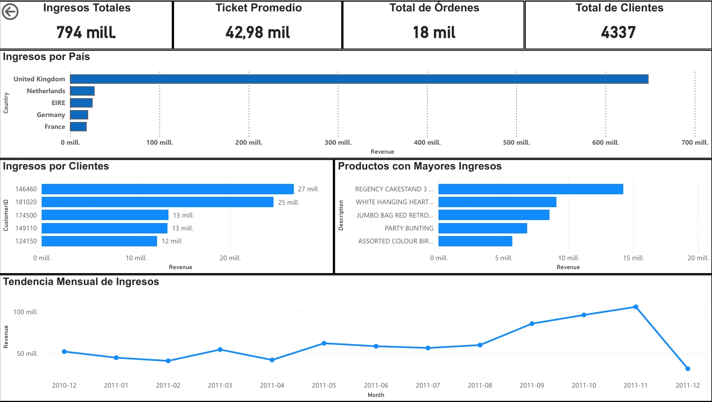

# Análisis de Ventas Ecommerce

Proyecto de análisis de datos de un ecommerce utilizando SQL y Power BI.

## 🛠 Herramientas utilizadas

* SQL
* DBeaver
* Power BI
* DAX

## 🎯 Objetivos del proyecto

* Limpieza y transformación de datos
* Análisis exploratorio
* Construcción de KPIs
* Visualización de métricas comerciales

## 📊 KPIs desarrollados

* Ingresos Totales
* Total de Órdenes
* Total de Clientes
* Ticket Promedio

## 📈 Resultados obtenidos

* Reino Unido concentra la mayor parte de los ingresos totales
* Los ingresos se encuentran concentrados en un grupo reducido de clientes
* Se identificó un fuerte crecimiento de ventas en los últimos meses analizados
## 📸 Dashboard

